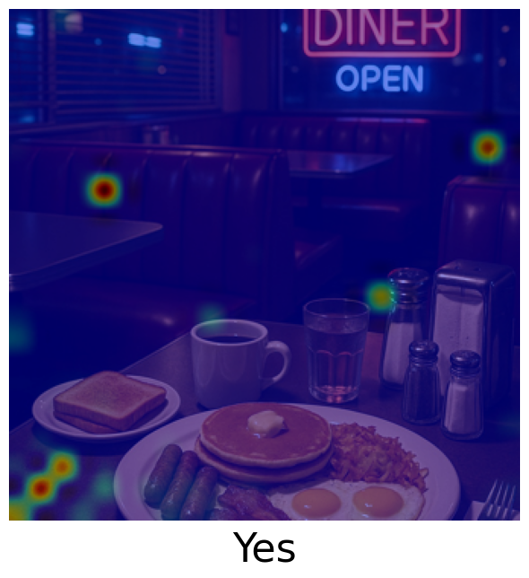
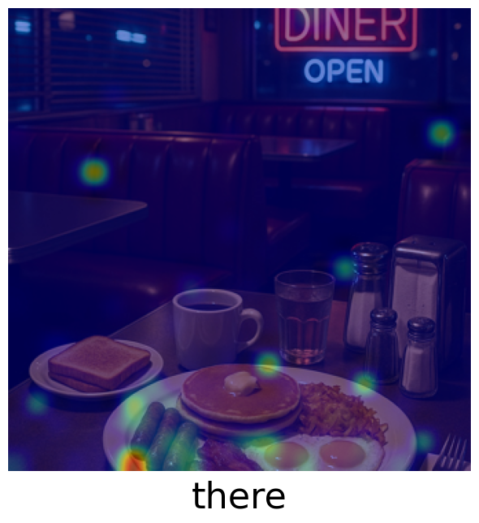
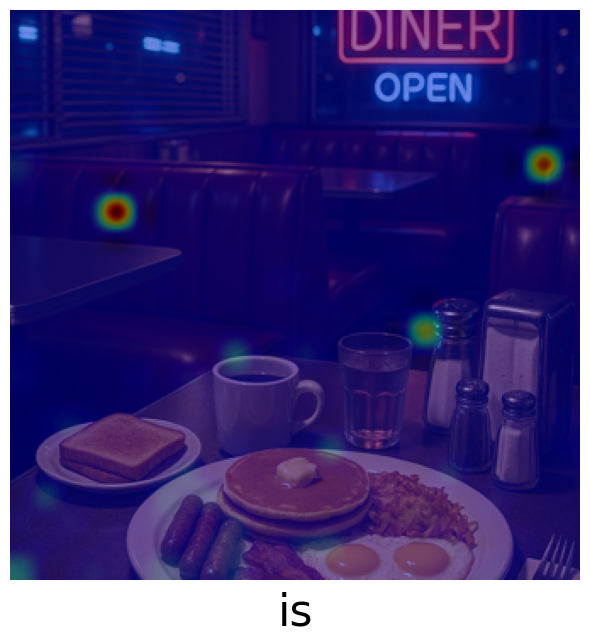
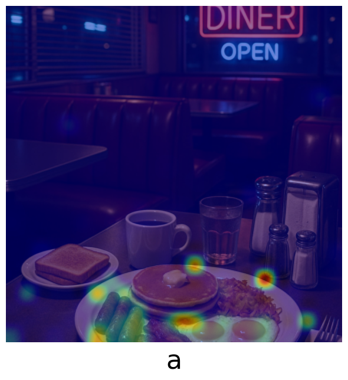
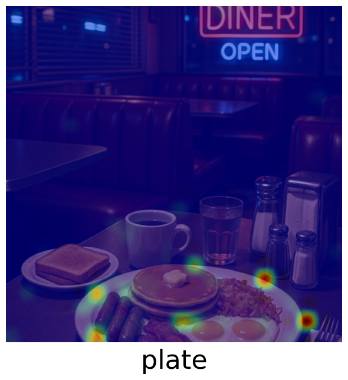
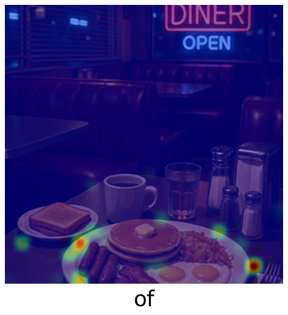
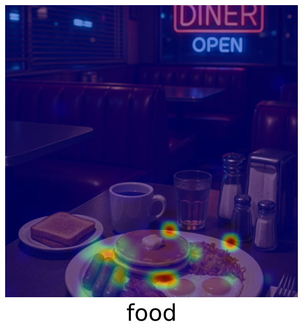
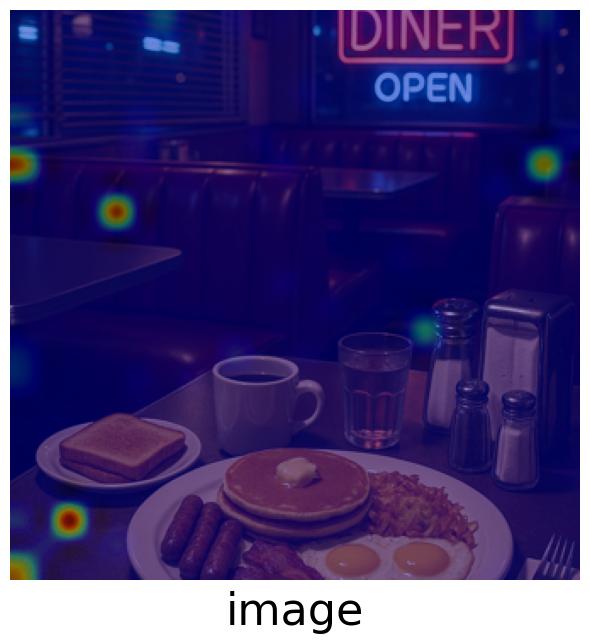

# 🧠 Explainable AI Toolkit for Multimodal Models

## Overview
This project presents an **Explainable AI (XAI) toolkit** designed to address the **black-box problem** in multimodal language models.  
It enables users to **extract, aggregate, and visualize attention** from the [`llava-1.5-7b-hf`](https://huggingface.co/llava-hf/llava-1.5-7b-hf) model.

The toolkit provides an interpretable view of the model’s internal reasoning by generating **attention heatmaps** that illustrate the relationship between generated text tokens and visual input regions effectively answering the question:  
> *Where did the model look when generating this token?*

Our pipeline supports:
- Extraction of attention weights across **specific steps, layers and attention heads**
- **Aggregation** of multi-head attention patterns for clearer interpretation
- **Visualization** of attention as overlayed heatmaps on input images

This toolkit contributes to enhancing transparency and interpretability in multimodal generative models, allowing researchers to analyze how multimodal language models integrate visual and textual information during generation.

## 🖼️ Example: Attention Visualization Output













<p align="center">
 
 
 
 
 
 
</p>


**Prompt:** *Is there food in the image?*  
**Answer:** *Yes, there is a plate of food in the image.*


## ⚙️ Quickstart & Usage

### 1. Environment Setup
For usage on the **bwHPC**, we recommend following the setup instructions provided in the [Medical_Imaging repository](https://github.com/DeveloperNomis/Medical_Imaging).  
That repository outlines the correct environment configuration for working on the bwHPC system.
Before starting, ensure that all dependencies are installed and compatible by running:
```bash
pip install -r requirements.txt
```

### 2. Model Download
Download the llava-1.5-7b-hf model by executing:
```bash
python download_model.py
```
This script will automatically retrieve the model weights and store them in the appropriate directory for later use.


### 3. Configuration
Open the attention.py file and navigate to the configuration section at the top of the script. Here, you can modify:
* File paths and filenames
* Experiment parameters (e.g., layers, heads, aggregation options)
* Output directories
* Attention Parameters
* reduction_config: Controls the dimensionality reduction used during attention aggregation.
  *  Recommended value: 2
* layers_config: Determines which layer(s) to extract attention from.
  *  Recommended value: 14
* heads_config: Specifies the attention heads to visualize.
  *  Recommended values: [13, 24]
Based on prior research (see References section), this configuration provided the most interpretable attention visualizations.


### 4. Running the Attention Extraction
Execute the main attention extraction script:
```bash
python attention.py
```

Depending on your configuration, the pipeline will:
* Extract and optionally aggregate attention heatmaps across specified layers and heads
* Save resulting visualizations as overlayed heatmaps in the output directory

If inspect == True the model’s inputs and outputs will be printed to the console and a text log file will be created, documenting:
* Timestamp
* Experiment parameters
* Input and output text


### 5. Reading the Output
Output filenames follow the convention:
* S = Step
* L = Layer
* H = Head

For example, S1_L14_H24.png corresponds to step 1, layer 14, head 24. If multiple steps are analyzed, token labels will be printed beneath each output image.


### 6. Options
You can choose between:
* Generating multiple heatmaps for specified parameters
* Aggregating results via the mean into a single composite heatmap
* This flexibility allows for both fine-grained and global analysis of visual attention.
* Multiple Prompts possible
* Multiple Images possible
