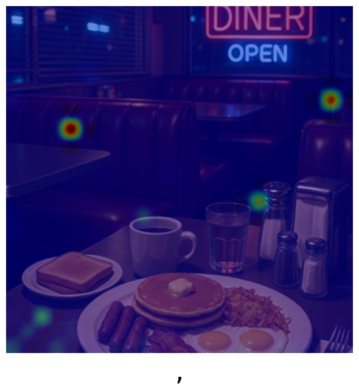
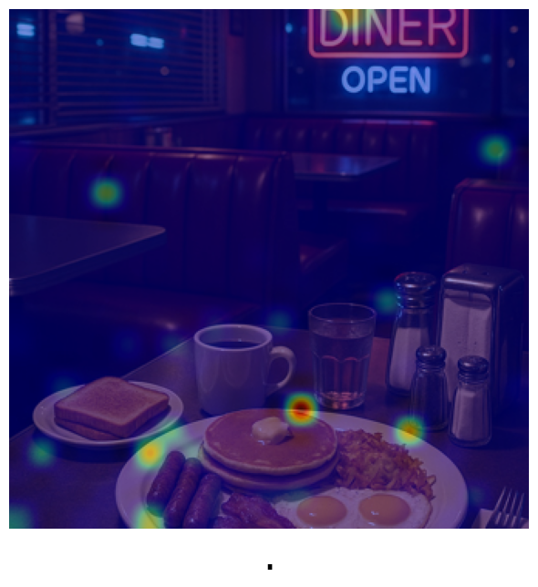

# 🌋 Explainable AI Toolkit for LLaVa


## Table of Contents
1. Overview
2. Motivation 
3. Example: Attention Visualization Output
4. Quickstart & Usage
     1. Environment Setup
     2. Model Download
     3. Configuration
     4. Running the Attention Extraction
     5. Options
5. Performance / Limitations
6. References

## 1. Overview
This project presents an **Explainable AI (XAI) toolkit** that addresses the **black-box problem** in multimodal language models.  
It enables users to **extract, aggregate, and visualize attention** from the [`llava-1.5-7b-hf`](https://huggingface.co/llava-hf/llava-1.5-7b-hf) model. By visualizing the model’s reasoning through attention heatmaps insight can be gained on how visual regions influence generated text. 

The toolkit leverages the attention maps within LLaVa’s multimodal transformer layers. These maps represent how strongly each image patch contributes to the model’s token predictions.

Attention matrices can be extracted at **specific layers, heads, or generation steps,** and optionally aggregated across dimensions (e.g., mean over heads) to improve interpretability.

The pipeline supports:
- Extraction of attention weights across **specific steps, layers and attention heads**
- **Aggregation** of the attention output for clearer interpretation
- **Visualization** of attention as overlayed heatmaps on input images

## 2 Motivation 
Multimodal large language models, like LLaVa have demonstrated remarkable performance, but the inner workings remain largely unknown. Understanding **how** these models ground visual information is critical for future research.

This toolkit provides a window into the reasoning process of LLaVa by enabling the extraction, aggregation, and visualization of attention patterns, helping researchers and developers understand which image regions influence textual outputs and why.

## 3. Example: Attention Visualization Output

### Input Image & Prompt
<table style="border: none; border-collapse: collapse;">
<tr>
<td style="border: none; padding: 5px;">
<strong>Prompt:</strong> <em>Is there food in the image?</em><br>
<strong>Answer:</strong> <em>Yes, there is a plate of food in the image.</em>
</td>
<td style="border: none; padding: 5px;">

</td>
</tr>
</table>


### Attention Visualization
The attention heatmaps illustrate how the model focuses on specific regions of the input image during token generation.

<p align="left">
 
 
 
 
 
 
 
 
 
 
 
 
</p>


## 4. Quickstart & Usage

### 1. Environment Setup

For usage on the **bwHPC**, we recommend following the setup instructions provided in the [Medical_Imaging repository](https://github.com/DeveloperNomis/Medical_Imaging).  
The repository contains a detailed guide for configuring your environment and dependencies on bwHPC.

For a step-by-step walkthrough on creating and configuring your bwHPC account, you can also refer to this Notion guide:  
[BW Cluster Public — Setup Guide](https://whip-seat-6cf.notion.site/BW-Cluster-Public-27819702d1364bc08b5c888217ff676b)

That repository outlines the correct environment setup for working on the bwHPC system. Afterwards ensure that all dependencies are installed and compatible by running:
```bash
pip install -r requirements.txt
```

### 2. Model Download
Download the llava-1.5-7b-hf model by executing:
```bash
python download_model.py
```
This script will automatically retrieve the model weights and store them in the appropriate directory for later use.


### 3. Configuration
Open the attention.py file and navigate to the configuration section at the top of the script. Here, you can modify:
* File paths (also to the input images)
* Output directories
* Prompts
* Experiment parameters 
(Recommendations are based on research done by Kang et al. 2025):

| Parameter | Description | Recommended setting |
| --- | --- | --- |
|`reduction_config`|Controls the dimensionality reduction used during attention aggregation by taking the mean.|`2`|
|`steps_config`|Determines which step(s) to extract attention from.|`'all'`|
|`layers_config`|Determines which layer(s) to extract attention from.|`14`|
|`heads_config`|Determines which attention heads to extract attention from.| `[13, 24]`|

For more information see the documentation in the attention.py file.

### 4. Running the Attention Extraction
Execute the main attention extraction script:
```bash
python attention.py
```

Depending on your configuration, the pipeline will:
* Extract and optionally aggregate attention heatmaps across specified steps, layers and attention heads
* Save resulting visualizations as overlayed heatmaps in the output directory

If inspect == True a text log file will be created, documenting:
* Generated output text
* Experiment runtime 
* Experiment parameters
* Input and output mappings


### 5. Options
You can choose between:
* Generating multiple heatmaps for specified parameters or
* Aggregating results via mean aggregation into a single composite heatmap
* This flexibility allows for both fine-grained and global analysis of visual attention.

## 6. Performance / Limitations 
  * Occasionally misinterprets results 
  * Demanding for resources and memory space 

## 7. References 
Kang, S., Kim, J., Kim, J., & Hwang, S.J. (2025, March 8). Your large vision-language model only needs a few attention heads for visual grounding. arXiv.org. https://arxiv.org/abs/2503.06287

<!-- 
<p align="center">
  
</p>
--->

<p align="center">
  <i>Thanks for visiting! Contributions and stars are always welcome ⭐</i>
</p>


