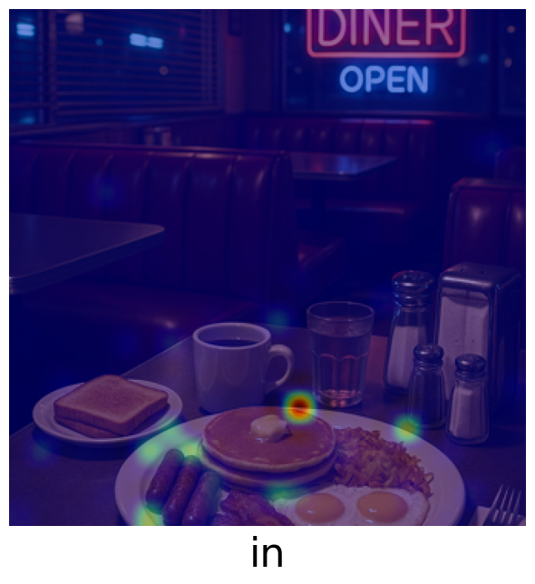
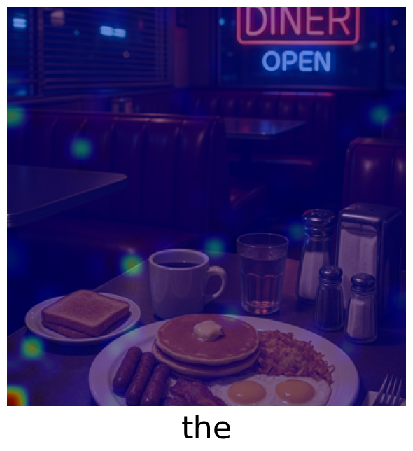

# 🌋 Explainable AI Toolkit for LLaVa


## Table of Contents
1. [Overview](#1-overview)
2. [Motivation](#2-motivation)
3. [Example: Attention Visualization Output](#3-example-attention-visualization-output)
4. [Quickstart & Usage](#4-quickstart--usage)
   1. [Environment Setup](#1-environment-setup)
   2. [Model Download](#2-model-download)
   3. [Configuration](#3-configuration)
   4. [Running the Attention Extraction](#4-running-the-attention-extraction)
   5. [Options](#5-options)
5. [References](#6-references)


## 1. Overview
This project introduces an **Explainable AI (XAI) toolkit** that addresses the **black-box problem** in multimodal language models.  
It allows users to **extract, aggregate, and visualize attention** from the [`llava-1.5-7b-hf`](https://huggingface.co/llava-hf/llava-1.5-7b-hf) model, revealing how image regions influence text generation through **attention heatmaps**.

The toolkit accesses LLaVa’s multimodal transformer attention maps, which show how strongly each image patch contributes to predicted tokens.  
Users can capture attention at **specific layers, heads, or generation steps**, and optionally **aggregate** it (e.g., mean over heads) to enhance interpretability.

**Features:**
- Extract attention weights by **layer, head, or step**  
- **Aggregate** attention across dimensions for clearer interpretation 
- **Visualize** attention as heatmaps overlaid on images  


## 2. Motivation
Multimodal models like LLaVa are powerful but opaque.  
This toolkit helps developers **inspect and interpret** the model’s attention patterns, offering insights into **how visual features shape textual outputs**.

## 3. Example: Attention Visualization Output

### Input Image & Prompt
<table style="border: none; border-collapse: collapse;">
<tr>
<td style="border: none; padding: 5px;">
<strong>Prompt:</strong> <em>Is there food in the image?</em><br>
<strong>Answer:</strong> <em>Yes, there is a plate of food in the image.</em>
</td>
<td style="border: none; padding: 5px;">

</td>
</tr>
</table>


### Attention Visualization
The attention heatmaps illustrate how the model focuses on specific regions of the input image during token generation.

<p align="left">
 
 
 
 
 
 
 
 
 
 
 
 
</p>


## 4. Quickstart & Usage

### 1. Environment Setup

For usage on the **bwHPC**, we recommend following the setup instructions provided in the [Medical_Imaging repository](https://github.com/DeveloperNomis/Medical_Imaging).  
The repository contains a detailed guide for configuring your environment and dependencies on bwHPC.

That repository outlines the correct environment setup for working on the bwHPC system. Afterwards ensure that all dependencies are installed and compatible by running:
```bash
pip install -r requirements.txt
```

### 2. Model Download
Download the llava-1.5-7b-hf model by executing:
```bash
python download_model.py
```
This script will automatically retrieve the model weights and store them in the appropriate directory for later use.


### 3. Configuration
Open the attention.py file and navigate to the configuration section at the top of the script. Here, you can modify:
* File paths (also to the input images)
* Output directories
* Prompts
* Experiment parameters 
(Recommendations are based on research done by Kang et al. 2025):

| Parameter | Description | Recommended setting |
| --- | --- | --- |
|`reduction_config`|Controls the dimensionality reduction used during attention aggregation by taking the mean.|`2`|
|`steps_config`|Determines which step(s) to extract attention from.|`'all'`|
|`layers_config`|Determines which layer(s) to extract attention from.|`14`|
|`heads_config`|Determines which attention heads to extract attention from.| `[13, 24]`|

For more information see the documentation in the attention.py file.

### 4. Running the Attention Extraction
Execute the main attention extraction script:
```bash
python attention.py
```

Depending on your configuration, the pipeline will:
* Extract and optionally aggregate attention heatmaps across specified steps, layers and attention heads
* Save resulting visualizations as overlayed heatmaps in the output directory

If inspect == True a text log file will be created, documenting:
* Generated output text
* Experiment runtime 
* Experiment parameters
* Input and output mappings

### 5. Options
You can choose between:
* Generating multiple heatmaps for specified parameters or
* Aggregating results via mean aggregation into a single composite heatmap
* This flexibility allows for both fine-grained and global analysis of visual attention.

## 6. References 
Kang, S., Kim, J., Kim, J., & Hwang, S.J. (2025, March 8). Your large vision-language model only needs a few attention heads for visual grounding. arXiv.org. https://arxiv.org/abs/2503.06287

<!-- 
<p align="center">
  
</p>
--->

<p align="center">
  <i>Thanks for visiting! Contributions and stars are always welcome ⭐</i>
</p>


